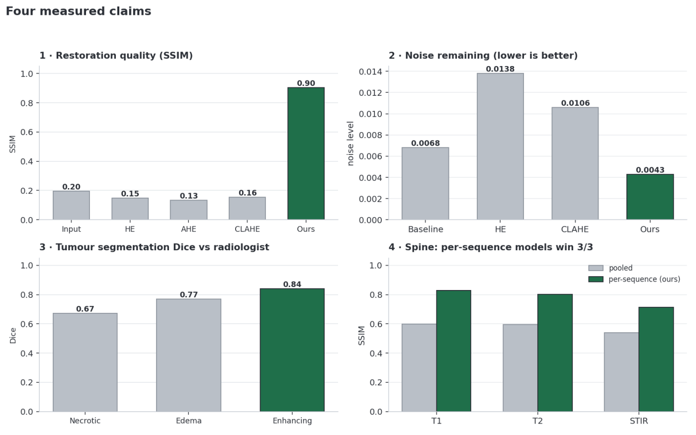
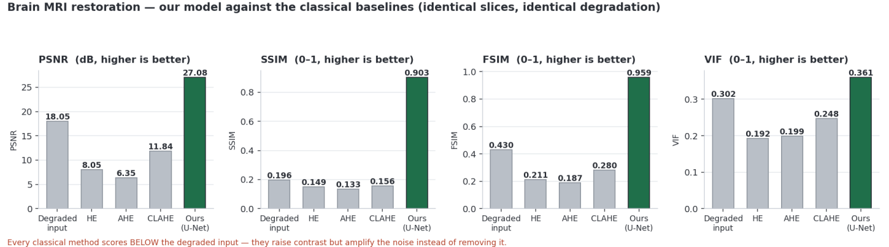
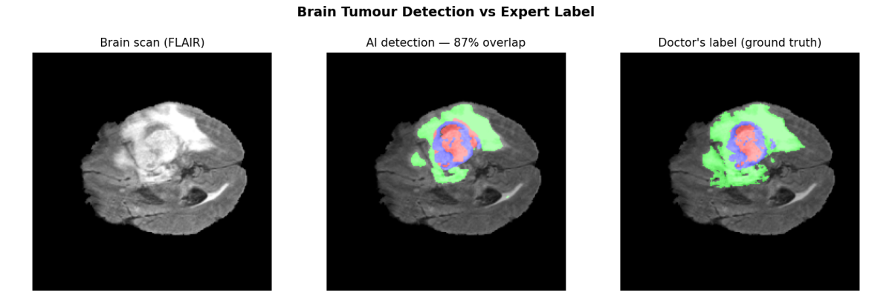
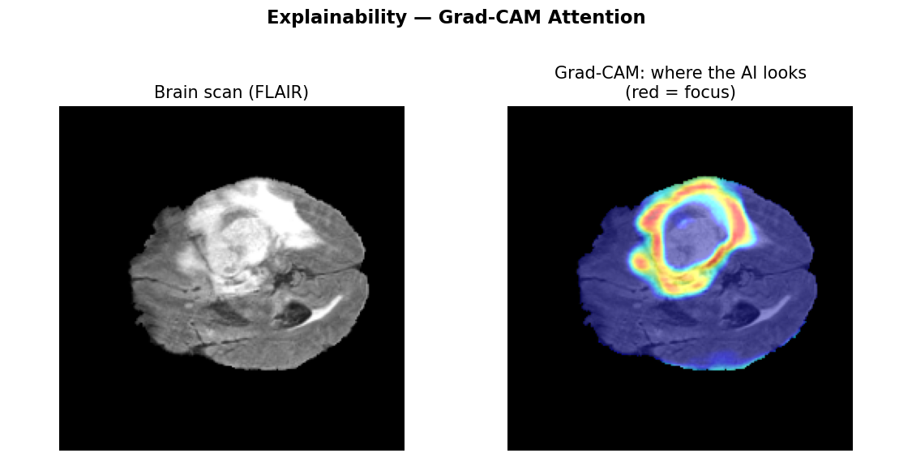
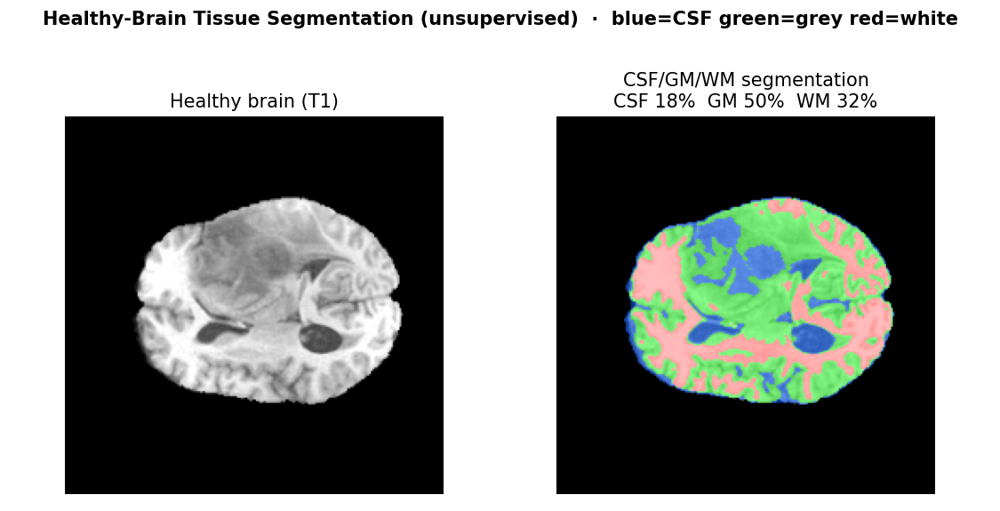
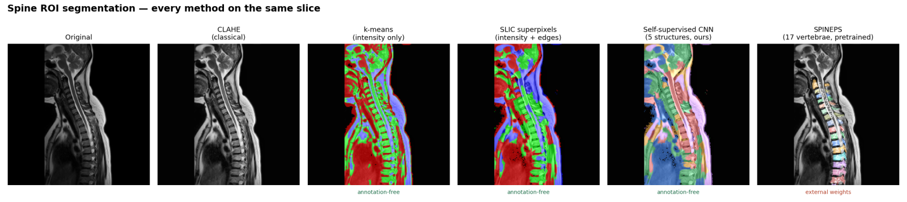
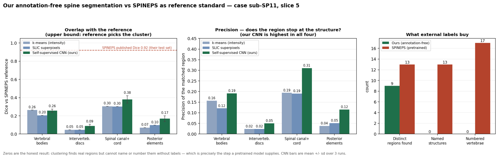
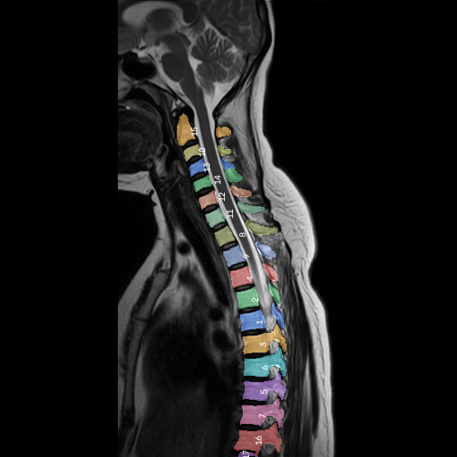
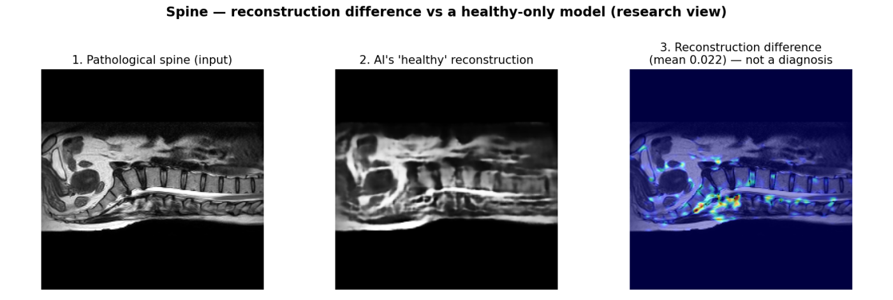

<div align="center">

# MRI Enhancement &amp; ROI Segmentation

**Restoring degraded MRI scans and delineating the region of interest —
brain and lumbo-sacral spine**

[](https://www.python.org/)
[](https://pytorch.org/)
[](#headline-results)
[](#headline-results)
[](#quick-start)

**3rd place — MedhaDrishti National AI Hackathon**
Yugma TechFest 2.0 · JNNCE Shivamogga

</div>

A complete pipeline that takes a noisy MRI scan, restores it with a deep-learning
model, and delineates the region of interest — for **brain** (tumour sub-regions,
CSF/grey/white tissue) and **lumbo-sacral spine** (vertebrae, discs, canal and
cord, plus canal morphometry).

Two things make this different from a typical hackathon submission. Every figure
is generated by a named script and stored as JSON, so nothing is hand-entered.
And the results that **failed validation are reported as failures** rather than
quietly dropped — see [the experiment that failed](#the-experiment-that-failed).

<div align="center">



</div>

---

## Headline results

| What | Result |
|---|---|
| Brain tumour segmentation | **mean Dice 0.76**, enhancing tumour **0.84** (vs radiologist, held-out patients) |
| Brain MRI restoration | **PSNR 30.3 dB · SSIM 0.965** (BraTS FLAIR) |
| Restoration vs classical | Ours **SSIM 0.90** vs CLAHE 0.16, HE 0.15, AHE 0.13 — *every classical method scores below the noisy input* |
| Noise actually removed | Ours **0.0068 → 0.0043**; HE and CLAHE *raise* it to 0.0138 / 0.0106 |
| Spine per-sequence models | Beat one pooled model on **3/3** sequences (T1 +0.23, T2 +0.21, STIR +0.17 SSIM) |
| Spine canal measurement | Canal found on **91/92** slices; narrowing ratio 0.485 pathological vs 0.557 normal (AUC 0.69, p=0.089 — a trend, not significant) |
| Spine anomaly detector | **Failed validation (AUC 0.27) — reported, not shipped** |
| Our spine segmentation vs a pretrained reference | Highest precision of all three annotation-free methods on **4/4** structures; best Dice **0.38** vs the reference's published **0.92** |
| Can canal width identify a diseased spine? | **No** — AUC 0.583 whole-spine, 0.688 per-level, p = 0.14. Tested twice, reported as negative |
| Speed | **4.2 ms/image · 236 images/sec**, 7.77 M parameters, 31 MB, 390 MB peak GPU |
| Cross-validation | 0.59 ± **0.04** Dice over 3 folds — consistent, not lucky |

Every number above is produced by a script in `src/` and stored as JSON in
`results/`. Nothing is hand-entered.

---

## What it produces

### Restoration — ours against the classical baselines



The striking part is that **every classical method scores below the noisy input**
(HE 8.05 dB, AHE 6.35, CLAHE 11.84, against the degraded input's 18.05). They
raise contrast and amplify the grain along with it. Ours reaches **27.08 dB /
0.903 SSIM** and is the only stage in the pipeline that reduces measured noise.

### Brain tumour segmentation, against the radiologist



Left the scan, centre our model, right the expert mask — on a patient held out
of training. Green oedema, red enhancing tumour, blue necrotic core. **Mean Dice
0.76, enhancing tumour 0.84.**

### Why it decided that — Grad-CAM



Red is where the network actually looked. It sits on the lesion, which is the
evidence that the Dice score is earned rather than coincidental.

### Healthy-brain tissue map



For a healthy brain the region of interest is not a tumour but the tissue
compartments. Unsupervised (Gaussian mixture over intensity), so it works on the
unlabelled data too.

### Spine — every method on the same slice



Intensity clustering floods the image because it groups **brightness**, so it
cannot separate two adjacent vertebrae that look identical. Our self-supervised
CNN resolves cord, vertebral chain and soft tissue **with no annotations**.
SPINEPS — a published pretrained model, labelled as such — adds the numbered
per-vertebra instances neither of ours can reach.

### How good is ours, measured against that reference



Both halves, honestly. Our CNN has the **highest precision of all three
annotation-free methods on all four structures**. And its best Dice is **0.38**
against the reference's published **0.92**, with **zero** numbered vertebrae —
because numbering requires labels the data does not have. That measured gap is
the argument for using a pretrained model for that one output.

### Per-vertebra instances from the pretrained model



17 vertebrae, each a separate instance. The numbers are **instance IDs** — "this
is a separate bone from the one above" — not a diagnosis and not a severity
score.

### The experiment that failed



An autoencoder trained on healthy spines only, so that whatever it cannot
reconstruct should be the pathology. The heat map looks persuasive. We validated
it rather than assuming it: **AUC 0.266 — worse than chance**, with normal spines
scoring *higher* than pathological ones. Five different scoring statistics, all
at or below chance. **We removed the detector and kept the negative result.**

---

## Quick start

### 1. Install

```bash
pip install torch==2.6.0 torchvision==0.21.0 --index-url https://download.pytorch.org/whl/cu124
pip install -r requirements.txt
```

CPU-only works too — drop the `--index-url` line. Python 3.10+.

### 2. Run the live demo

```bash
python src/webapp.py
```

Then open **http://localhost:5000**. (Windows: double-click `run_demo.bat`.)

Upload any `.nii` / `.nii.gz` scan, choose Brain or Spine, and every processing
stage is shown with its own output and measured scores. No internet required.

---

## What the demo does

**Brain — 7 stages:** upload → histogram equalisation → CLAHE → **U-Net restoration**
→ **tumour detection** → CSF/grey/white tissue map → **Grad-CAM** attention.

**Spine — 6 stages:** upload → HE → CLAHE → **U-Net restoration** (the model matching
the detected sequence) → **SLIC region segmentation** → **spinal-canal delineation and width measurement**.

Two more views:

- **Validate against expert annotation** — pick any of 127 held-out BraTS cases and
  see the model's tumour mask beside the radiologist's, with the overlap score.
- **Inside the model** (`/model`) — a white-box trace: all 63 operations, tensor
  shapes, parameter counts, the loss functions, and the *actual* feature maps
  captured from a live forward pass.

---

## Folder map

```
.
├── run_demo.bat            Double-click to launch the demo (Windows)
├── requirements.txt        Python dependencies
├── README.md               You are here
│
├── src/                    ALL source code (37 modules)
│   ├── webapp.py             the live demo web application
│   ├── models.py             the U-Net architectures
│   ├── nifti_utils.py        NIfTI loading, normalisation, slicing
│   ├── metrics.py            every evaluation metric in one place
│   │
│   ├── train_*.py            training scripts (segmentation, enhancement)
│   ├── spine_autoencoder.py  self-supervised spine anomaly detection
│   ├── spine_pipeline.py     classical spine enhancement + SLIC ROI
│   ├── tissue_segmentation.py CSF / grey matter / white matter
│   ├── gradcam.py            attention maps
│   │
│   ├── dataset_stats.py      Stage-1 dataset analysis
│   ├── resolution_stats.py   Stage-1 MRI resolution analysis
│   ├── preprocessing_assessment.py  Stage-2 before/after property tables
│   ├── annotation_viz.py     Stage-2 label visualisation
│   ├── benchmark.py          latency / throughput / memory / complexity
│   ├── cross_validation.py   k-fold validation
│   ├── paper_comparison.py   comparison against classical baselines
│   ├── coco_export.py        COCO JSON mask export
│   └── comparison_graphs.py  the result figures
│
├── models/                 Trained weights (.pt) — 12 checkpoints
├── results/                All metrics as JSON + COCO exports
├── stats/                  Dataset analysis tables (CSV + JSON)
├── outputs/                Generated figures, overlays, demo page
│   └── demo/demo_page.html   offline slide-style walkthrough
├── showcase/               Curated unseen scans for live demonstration
└── data/                   Datasets (not in git — see below)
```

---

## Datasets

| Dataset | Role | Annotations | Where |
|---|---|---|---|
| **BraTS2020** (4.47 GB, 369 cases) | standard **training** set | yes — expert tumour masks | Kaggle `awsaf49/brats20-dataset-training-validation` → `data/brats_subset/` |
| **Hackathon offline** (40 cases) | **testing / validation** | none | provided by the organisers |

We extracted and used **126 BraTS cases**. Splits are always at **patient level**,
never slice level — slices from one patient are highly correlated, so a slice-level
split would leak information and inflate every score.

Offline data is split **5 train / 5 test** per group, following the organisers'
instruction. Full per-case enumeration: `stats/splits_report.txt`.

**Format policy:** every volume is read directly from `.nii`/`.nii.gz` with nibabel.
No dataset file is ever converted to another format; PNG and JSON are outputs only.

> Datasets and model weights are excluded from git (~17 GB). See `.gitignore`.

---

## Reproducing the results

Run from the project root, in this order:

```bash
python src/dataset_stats.py                 # Stage 1 — dataset properties
python src/resolution_stats.py              # Stage 1 — MRI resolution
python src/annotation_viz.py                # Stage 2 — label visualisation
python src/preprocessing_assessment.py      # Stage 2 — before/after properties
python src/train_enhancement_brain.py       # Stage 3 — enhancement model
python src/train_segmentation_brain.py      # Stage 4 — segmentation model
python src/full_segmentation_metrics.py     # Stage 4 — complete metric suite
python src/paper_comparison.py              # Stage 3 — vs classical baselines
python src/benchmark.py                     # efficiency study
python src/comparison_graphs.py             # result figures
python src/build_demo_page.py               # offline walkthrough page
```

---

## Method in one paragraph

Both tasks use a **2D U-Net** (encoder → bottleneck → decoder with skip
connections). For **restoration**, the network is trained on clean scans paired
with synthetically degraded copies — degraded with **Rician noise** (the correct
noise model for MRI magnitude images, not Gaussian) plus a smooth multiplicative
**bias field** — using an `L1 + SSIM` loss so both intensity and structure are
preserved. For **segmentation**, all four modalities (T1/T1c/T2/FLAIR) are stacked
as input channels, because each reveals a different part of the tumour, and the
loss is `cross-entropy + soft Dice` — Dice is essential because tumour classes are
under 1 % of pixels and cross-entropy alone would collapse to predicting
background everywhere. Slice-based 2D processing keeps the memory footprint inside
a 6 GB laptop GPU.

**Spine uses no annotations at all**, as required: restoration is self-supervised,
region segmentation is unsupervised SLIC clustering, and we additionally **measure the
spinal canal** — segmenting the CSF column, finding its axis by PCA (so orientation is
irrelevant) and reporting the width profile. Stenosis *is* canal narrowing, so this
reports the quantity a radiologist reads rather than predicting a label. We also tested
autoencoder anomaly detection and **validated it rather than assuming it worked — it
failed**, see limitations.

---

## Honest limitations

- Quantitative segmentation scores are reported **only on BraTS**, where expert
  annotations exist. On the unlabelled hackathon data we report enhancement metrics
  and qualitative segmentation, and say so plainly rather than inventing numbers.
- **Our spine anomaly detector failed validation and the claim was withdrawn.** Scored
  on held-out cases it gives **AUC 0.27** — worse than chance, with healthy spines
  scoring *higher* than pathological ones — because the reconstruction error tracks
  image texture, not disease (`results/anomaly_validation.json`). The map is retained
  as a visualisation only. An unvalidated detector that fires on healthy patients is
  worse than no detector at all.
- The restoration model corrects noise and intensity artefacts. It does not
  invent anatomy — SSIM above 0.9 against the true scan is the evidence for that.

---

## Running a single stage

Each file in `demos/` runs one stage on its own, prints its real numbers, and
saves the figure to `outputs/demo_runs/`. Each file's docstring explains the
architecture, the loss and the inputs for that stage.

```bash
python demos/03_brain_unet_enhance.py    # our enhancement model
python demos/04_brain_tumour_seg.py      # tumour segmentation
python demos/12_spine_selfsup_seg.py     # annotation-free spine segmentation
python demos/run_everything.py           # every stage, brain then spine
```

## Reproducing the pretrained-model comparison

SPINEPS runs in its own conda environment, because it requires Python 3.11 and
pins dependencies that would disturb the main one:

```bash
conda create -n spineps python=3.11 -y
conda activate spineps
pip install torch==2.6.0 torchvision==0.21.0 --index-url https://download.pytorch.org/whl/cu124
pip install spineps
pip install --force-reinstall --no-deps torch==2.6.0 torchvision==0.21.0 --index-url https://download.pytorch.org/whl/cu124
```

That last line is not redundant: `pip install spineps` pulls `nnunetv2`, which
replaces the CUDA build of torch with the CPU wheel and leaves `torchvision`
mismatched. Reinstalling the matched pair with `--no-deps` afterwards fixes it.

Two further notes, both found the hard way:

- The **instance phase** forwards its whole working volume at once and needs
  about 12.4 GB of VRAM. On a 6 GB card it runs on CPU (~400 s). The semantic
  phase fits on GPU and completes in well under a minute.
- SPINEPS **resamples and reorients** its masks, so they cannot be matched to
  the input by array index — `spineps_runner.mask_in_scan_space()` maps them
  back through the image affine.

Then:

```bash
python src/spine_vs_spineps.py       # our methods scored against the reference
python src/spine_stenosis_test.py    # can canal width separate the groups?
python src/spine_level_analysis.py   # where is the canal narrowest?
```
